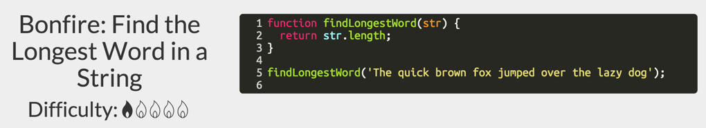
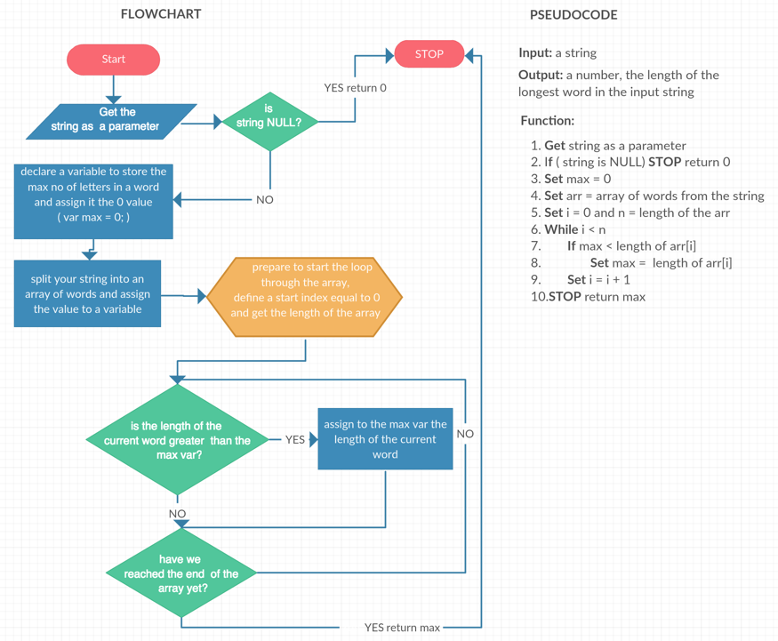
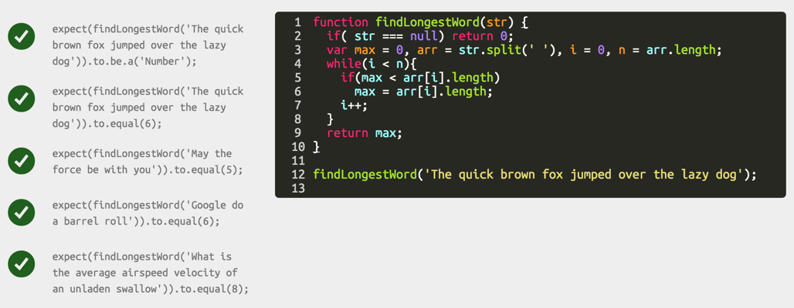

**[How to start when you are stuck (I)](https://github.com/FreeCodeCamp/freecodecamp/wiki/How-to-start-when-you-are-stuck-(I))**

**[How to start when you are stuck (III)](https://github.com/FreeCodeCamp/freecodecamp/wiki/How-to-start-when-you-are-stuck-(III))**

Let’s try an example. If we take a look at one of the Free Code Camp exercices, and let’s choose a more simple one: [find the longest word in a string](http://www.freecodecamp.com/challenges/Algorithm-find-the-longest-word-in-a-string). We can start and draw a flowchart for it and write a first solution in pseudocode.

So what does Free Code Camp want from us with this problem? Well it wants us to create a function that gets a string as a parameter and returns an integer. This integer should represent the length of the longest word in this string. Usually you can solve a problem on Free Code Camp by just looking at the **More information** text. In this case Free code camp is giving us some very good tips:

    Return the length of the longest word in the provided sentence.
    Your response should be a number.
    Remember to use RSAP if you get stuck. Try to pair program. Write your own code.
    Here are some helpful links: String.split(), String.length

If we take a look at the Free Code Camp suggestions we’ll see that String.split() can be used to split a string into an array and String.length gives us the length of a string. This helps us think of an algorithm. What if we split the string into an array, we loop through it and using the length attribute we find out the length of the longest word. Hmm, doesn’t seem very complicated but how to start this? Well ... take a look at the image below.

If we follow the schema AND/OR the pseudocode, writing the function that gives us the length of the longest word in a string shouldn’t be very hard now … in any language … not just in javascript.

Now that we have this first working version, we can try and rewrite it using a for loop. Or we can take a look at forEach and if we really want to go wild we can rewrite this using the functional programming way. So let’s challenge ourselves to write a “one line” solution for the problem.

Searching through the MDN documentation you’ll find out that you can use the max function on arrays and that there is a map function that helps us change the current array. Hmm … that should should help us … right? Yes! the idea remains the same, you get a string, split it into an array and you return an integer but here is how:

**[How to start when you are stuck (III)](https://github.com/FreeCodeCamp/freecodecamp/wiki/How-to-start-when-you-are-stuck-(III))**
