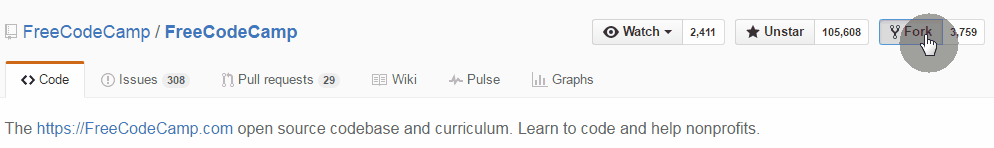

# Do Translations.

When you want to work on any of the translations, we encourage you to leave a comment like `"Working on it"` on the [open/ongoing translation issues](https://github.com/FreeCodeCamp/FreeCodeCamp/issues?q=is%3Aissue+is%3Aopen+label%3Atranslation). This will notify the contributors about your interest in doing the translation.

Check the technical steps in this guide for doing translations.

After this you will have up to 15 days to create a [Pull Request](How-To-Create-A-Pull-Request-for-Free-Code-Camp) with the proposed translation or updating an existing one.

We invite you to check the directories and files in  [`seeds/challenges`](https://github.com/FreeCodeCamp/FreeCodeCamp/tree/staging/seed/challenges) for doing translations.

> _Pro Tip : Remember to discuss your progress in chat rooms. Being active in the chat, reflects that you are working on it!_

### Technical procedure to create a translated file

 1. [Install git](https://www.git-scm.com/) on your computer and [create an account on GitHub](https://github.com/join) if you don't have one already.

 2. From your GitHub account [_fork_](https://help.github.com/articles/fork-a-repo) the FreeCodeCamp repository ([https://github.com/FreeCodeCamp/FreeCodeCamp](https://github.com/FreeCodeCamp/FreeCodeCamp)). That's it! Now, you have a _fork_ of the original repo under your account.

 

 3. Launch a terminal/command prompt and clone a local copy of your fork to your computer (replace the word `USERNAME` with your github account's username):

 ```sh
 git clone --depth=1 https://github.com/USERNAME/FreeCodeCamp.git
 cd FreeCodeCamp
 ```
 [Learn more on forking ...](https://help.github.com/articles/fork-a-repo/)

 4. Now, on GitHub, go to the [_Issues_ Section](https://github.com/FreeCodeCamp/FreeCodeCamp/issues) of the FreeCodeCamp repository and look for the [open/ongoing translation issues](https://github.com/FreeCodeCamp/FreeCodeCamp/issues?q=is%3Aissue+is%3Aopen+label%3Atranslation), and as mentioned in the **Do Translations** section above and leave a comment like `"Working on it"`, if no one is working on it (or has been left unattended for more than 2 weeks). As always confirm in the Chat rooms when you need guidance.

 5. In your forked repository, create a _branch_ with a name such as `"translate/LG-translation-XXX-YYY"` where `Lg` is the abbreviated name of the language you're working on, and `XXX-YYY` is the name of the file you're going to modify.

 ```sh
 git checkout -b translate/Es-translation-basic-javascript
 ```

 In the example above `Es` is the language code for Español (Spanish) and `basic-javascript` is the name of the JSON file, that is to be transated. Refer the list of [Two letter codes](https://en.wikipedia.org/wiki/List_of_ISO_639-1_codes) for your language, for clarity.

 [Learn more on branching ...](https://github.com/Kunena/Kunena-Forum/wiki/Create-a-new-branch-with-git-and-manage-branches)

 6. Find the `JSON` file in the `seeds/challenges` directory in your local copy. Find the challenge of your interest and modify it by adding the name of the challenge in `"titleLg"` and its description in `"descriptionLg"`, where `"Lg"` is the language of your choice.

 It's important to keep the proper syntax of the `JSON` file (a.k.a linting the file). You can verify this by installing `node.js` and passing the `JSON` file to the interpreter. For example: `node seeds/challenges/basic-javascript.json`.

 You will also be able to verify the syntax by copying and pasting the content of the file in [http://jsonlint.com](http://jsonlint.com).

 7. When you're done, _commit_ your changes with a brief description in English (regardless of the language). Afterwards, _push_ the changes to your fork:

 ```sh
 git commit -m "Challenges of Basic Javascript translated." seed/challenges/basic-javascript.json
 git push origin add/Es-translation-basic-javascript
 ```

 [Learn more on pushing changes ...](https://help.github.com/articles/pushing-to-a-remote/)


If you think that you can't continue for a while with the translation, you can leave a comment on the same issue, indicating that another person should continue. You can push your changes so far so the next person won't duplicate your hard work.

-------
[**Back to Translations Guide**](Translations-Guide)
