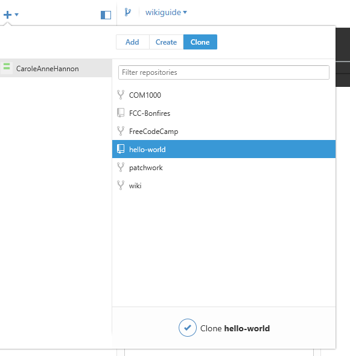
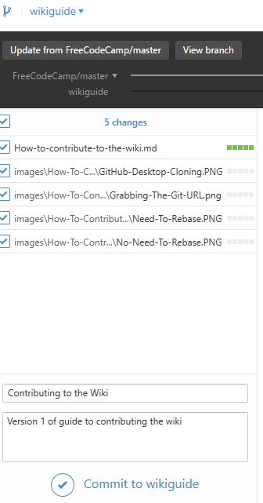

# How To Contribute To The Wiki

This is a step-by-step guide, aimed at people new to Git, which covers how to use GitHub Desktop as well as the Git command line

As such there might be 2 sets of directions: GitHub Desktop first, then command line version

GitHub Desktop is a GUI interface, but there are benefits to learning the command line way too (speed, shortcuts, more powerful commands, and being able to talk to people who are old school). It might be beneficial to you to try the Command Line way after you get more comfortable with GitHub

## Table Of Contents

1. [Initial: One Time Setup](#initial-one-time-setup)

  - [Cloning](#cloning)

2. [Part 1: Choose What To Work On](#part-1-choose-what-to-work-on)

3. [Part 2: Making A New Branch](#part-2-making-a-new-branch)

4. [Part 3: Getting Ready To Edit](#part-3-getting-ready-to-edit)
5. [Part 4: Commit To Your Branch](#part-4-commit-to-your-branch)
6. [Part 5: Pull Request To FCC Wiki Repo](#part-5-pull-request-to-fcc-wiki-repo)
7. [Markdown Editing And Viewing Tools](#markdown-editing-and-viewing-tools)

## Initial: One Time Setup

1. Have a GitHub Account
2. Get Git on your computer

  - [GitHub Desktop](https://desktop.github.com/). Also comes with Git Shell (a command line interface)
  - Other Git clients like Git Bash

3. Go to the [Wiki Repo](https://github.com/FreeCodeCamp/wiki)

  - **CAREFUL:The Wiki is stored at a different repo than the main FCC site**
  - The above link is where you need to go

4. Click on **Fork** if you don't already have a Fork

  - This will recreate the Wiki Repo under your username
  - This will also automatically create the same branches that the FCC wiki Repo has. Thus you will now have a master **branch** as well

Vocabulary | Meaning
---------- | ----------------------------------------------------------------------------------------------
Repository | A data structure to manage a project or set of files and the changes it receives
Repo       | A shorter way to say Repository
Branch     | A pointer to a version of a repo as of when the branch was last created/updated from that repo

### Cloning

_The following image is a reference to both sets of directions_

#### Github Desktop Directions

On **_your_** forked repository page, click the button that looks like a screen with an arrow (the reference image above has it as the red marker). This will open GitHub Desktop to clone it automatically

If it doesn't do it automatically, you can:

- Open GitHub Desktop yourself
- Click on the Arrow on the top
- Select Clone
- Pick the fork your wish to clone
- Click on "Clone wiki"
- Select where to clone it into

  

#### Command Line Directions

`git clone <REMOTEURL>`

example: `git clone https://github.com/yourusernamehere/wiki.git`

You can grab the repository URL on your fork. The image above shows a button that will copy it to your clipboard

Vocabulary | Meaning
---------- | -----------------------------------------
Fork       | A repository made from another repository
Clone      | A local instance made from a repository

## Part 1: Choose What To Work On

Feel free to look at the [issues](https://github.com/FreeCodeCamp/wiki/issues) on the Wiki's repo

Additionally you can contact [@Rafase282](https://gitter.im/Rafase282) or ask in the [Wiki Chat](https://gitter.im/FreeCodeCamp/Wiki)

Lastly you could just make a change you feel is needed without coordinating with anyone - typo fixes for example

Keep in mind, these are all **Markdown** files. If you are creating a new file, for a new wiki article, it **has** to be in [Markdown format](https://github.com/adam-p/markdown-here/wiki/Markdown-Cheatsheet), and filename **must end in `.md`**.

## Part 2: Making A New Branch

You should make a new branch and not work on master.

- Branches should be named after what the change you are performing.
- This makes it easier for the person reviewing the pull request later on to have an idea what is worked on.
- -Not using master also makes it easier to start over if you accidentally mess up your branch. Otherwise, you will either have to do a force reset back to a point in time which you know was in sync with the FCC wiki master, or you will have to delete and recreate your fork!

**GitHub Desktop Directions**

- Click on the Fork icon and it'll show you a tiny form to create a branch
- Make sure your From Branch is FreeCodeCamp/master (or upstream/master if you have one)
- This will ensure your new branch is off the current version of FCC wiki's master

**Command Line Directions**

**_Setting up an upstream_**

`git remote add upstream <REMOTEURL>`

example: `git remote add upstream https://github.com/FreeCodeCamp/wiki.git`

- **_Why use upstream?_**

  - More than likely you already have a connection called FreeCodeCamp (which you can check by doing `git remote -v`), so why make a new one called upstream that will go to the same place?
  - It's a good habit. When you eventually work on multiple repos at the same time, you might not always remember what each one was originally called (since it's based on the username of the original repo owner). Making a new connection for each called "upstream" means you only have to remember one name
  - Technically it could be anything, but upstream is used by convention

**_Setting up the new branch_**

`git checkout -b <local branch name> <remote>/<remote branch name>`

example: `git checkout -b mybranchname upstream/master`

Making your new branch off of the upstream's master will ensure it is made off the latest version of the FCC wiki

Vocabulary | Meaning
---------- | --------------------------------------------------------------
Upstream   | a common name for the repo that one created a branch/fork from

## Part 3: Getting Ready To Edit

Get to your directory on your local machine

_Github Desktop note_

_You can right click and use "Open in Explorer"_ _Also if you cut your directory into another location, GitHub desktop will then no longer be able to find it and ask you the new location. This makes it very easy to move to a different location_

**Understanding how the wiki works**

All of the files for the wiki are .md files. These are **markdown** files. They use [markdown language](https://github.com/adam-p/markdown-here/wiki/Markdown-Cheatsheet) for the formatting of the files.

- The Algorithm pages begin with Algorithm
- The Challenges pages begin with Challenge
- The JavaScript references pages begin with js
- The Front End Project pages begin with Front End Project
- The Back End Project pages begin with Back End Project
- There are no spaces in the file names. use - instead
- Files should be Title Cased (the first letter of each word should be capitalized)

Simply edit the file on your machine, or make a new one. If you are making a new file, make sure the filename ends in `.md`.

## Part 4: Commit To Your Branch

Now that you've made your change, you have to _commit_ and _push_.

**GitHub Desktop Directions** 

- Go to GitHub Desktop
- Click on the branch (even if you're on it. This will guarantee it'll refresh)
- If it's on History, click on Changes tab (top)
- You should be able to:

  - see which files are changed
  - see what the differences are (if any. New files will obviously not have differences)
  - check/uncheck files to include in the commit

- Write a summary (required)

  - the summary should reflect what is being edited
  - If you are doing a specific issue, do NOT add the issue number to the Summary

- Write a description (optional)

  - more details about what is being edited
  - If doing a specific issue, append to the end of the commit message `closes #1337`. This tells GitHub to close that issue if the PR is merged

- Click on Commit

  - Commit will only put it on your local

- Click on Sync

  - This will "push" it to the online version of your branch

**Command Line Directions**

- add files to be committed:

  - `git add <filename>`

    - Adds a specific file
    - example: `git add myfile.txt`

  - `git add -A`

  - -Adds everything that's changed

  - `git add filestring*`

    - adds everything starting with filestring
    - example `git add Algorithm*`

- commmit:

  - git commit -m "Short Description of Change"

    - the message should reflect what is being edited
    - If doing a specific issue, append to the end of the commit message `closes #1337`. This tells GitHub to close that issue if the PR is merged

- push:

- -`git push <REMOTENAME> <REMOTEBRANCH>`

  - example `git push origin wikiguide`

Vocabulary | Meaning
---------- | ---------------------------------------------------------------------
Commit     | changes made to a repository
Push       | Applies a commit from your local to the remote version of your branch

## Part 5: Pull Request To FCC Wiki Repo

**GitHub Desktop Directions**

- Click on the Pull Request Icon/Test
- Select FreeCodeCamp/master (or upstream/master if you have it set up)
- Write a title and description
- Check to see if the pull request can be automatically merged

  - If not, try to find out why not

- Send pull request

  - If it fails, sometimes trying again works

**Website Directions**

- Make sure you are on the branch you wish to submit a PR from
- Click on Compare & Pull Request
- Review the form
- Click "Create pull request"

Vocabulary   | Meaning
------------ | --------------------------------------------
Pull Request | A request to another repo to take in changes
PR           | Short way of saying Pull Request

## Markdown Editing And Viewing Tools

### Atom: Markdown Live Preview

A plugin for the Atom editor, targeted for GitHub.

### Chrome extension: Markdown preview plus

A viewing extension. If you set up .md files to automatically open in Chrome, it makes viewing them really easy

Use the Github theme to have a better feel of the end result

