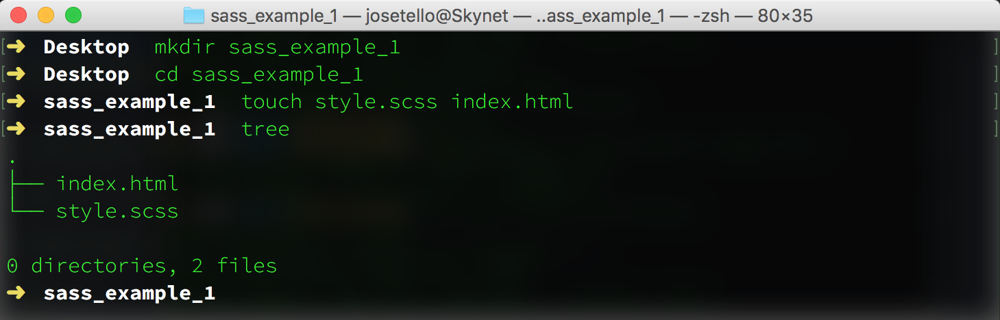

# Up and Running with Sass

## Part 1: Getting Started


### Introduction

Sass stands for "Semantically Awesome Stylesheets" and is a CSS Pre-Processor. A Pre-Processor compiles code written in a specific language down to "product" code that is machine-readable (browser-readable). Basically, Sass compiles code down to regular CSS that our browsers can interpret! *Why write code in Sass when CSS already exists?* The short answer is Sass comes with more powerful features built into its syntax that allow developers to write DRY-er, scalable, and more maintainable front-end code.

If you're familiar with CSS, then learning Sass will come a little easier to you. If not, it might be ideal to start learning some CSS basics on Free Code Camp's HTML5 & CSS section in their Front End Development Certification course, as well as taking a look at [MDN's CSS Article](https://developer.mozilla.org/en-US/docs/Web/CSS).

In Part 1 of this article, I will explain how to get Sass installed on your computer and how to compile your Sass-written code into CSS.

### Installation

The simplest way to install Sass onto your machine is through the command line. Sass is a Ruby gem and will require the following command:

For Macs and PCs:

```sudo gem install sass```


For Linux you will need to install the Ruby language first, then:

```sudo su -c "gem install sass"```

You should now be able to check the version of Sass installed:

```sass -v```

And it should return something similar to:

```Sass 3.4.21 (Selective Steve)```

If so, congrats, you've just installed Sass! Now onto using Sass.

### Basic Use & Syntax

Let's begin with a very simple example to illustrate how Sass actually works. You can follow along with the steps or simply read along.

*An import sidenote: Sass can be written in two slightly different styles, each of which has its own benefits. One style will use the file extension* ```.sass``` *and the other will use* ```.scss```. *Brief explanations will be given on the differences of the two styles later on. For an in-depth explanation, check out John W. Long's* [Sass vs. SCSS article](http://thesassway.com/editorial/sass-vs-scss-which-syntax-is-better).

*For the sake of consistency, this article will provide code examples in ```.scss``` format, however both styles are equally popular.*

Alright, let's get started. We will create a new folder to house our example files (you may do this anywhere on your computer, and can use the command line or do this manually).

In the folder, we will create a file called ```style.scss``` and an HTML file to style called ```index.html```:



*The ```tree``` command in the image above is from an npm package you can install and is not native to the command line. The ```ls``` command essentially does the same.*

Now that we have our project folder setup, we can use the Sass watch command to "keep an eye" on our Sass file and compile our code when it detects a change in the file. We type in the watch command on the file we want to watch:

```sass --watch style.scss```

The next step is to open up the project folder in your text editor of choice. Once we have our files opened and ready for editing, we can add in a very basic HTML page (for us to style) which will look like the following:

```
<!DOCTYPE html>
<html lang="en">
<head>
  <meta charset="UTF-8">
  <title>Sass!</title>
  <link rel="stylesheet" href="style.css">
</head>
<body>
  <article>
    <h1>Hello World</h1>
    <p class="cat-paragraph-1">Cat ipsum dolor sit amet, stand in front of the computer screen, so chase imaginary bugs has closed eyes but still sees you caticus cuteicus.</p>
    <p class="cat-paragraph-2">Drink water out of the faucet chew on cable or if it fits, i sits roll on the floor purring your whiskers off.</p>
  </article>
</body>
</html>
```

After setting up the HTML we can open up our ```style.scss``` file and begin styling in Sass. In the sample code below, you will probably notice how some the style selectors are nested within the article selector; something unique to Sass. Don't fret, the syntax will be explained in Part 2. For now we just want to acquire an understanding of how Sass works in its simplest form.

```
article {
  h2 {
    font-family: Arial;
    color: blue;
  }
  .cat-paragraph-1 {
    color: red;
  }
  .cat-paragraph-2 {
    color: green;
  }
}
```

Once that code has been typed and saved into the ```style.scss``` file, the watch task we punched into the command line will have detected a change in the file, compiled our Sass to CSS, and output a new file titled ```style.css```. You may also see a file called ```style.css.map``` in your project folder that has magically appeared as well. This file is called a sourcemap and is of great use when debugging Sass, but for now we'll just leave it be.

Below we can see the files listed in the project folder.


And now if we open up ```index.html``` in a web browser, we can see our HTML page styled using CSS which was compiled from the sample Sass code. Similarly, we can open up the ```style.css``` file to see how Sass output the original Sass code. Compact, isn't it?

### Where To Go From Here?

*Great! Now I know how to compile Sass on my computer. Is that it?*

Not by a long shot. This was a bare-bones example of how Sass works, therefore the benefits of writing in Sass over vanilla CSS may not be apparent. We wrote 12 lines of "Sass" and got 7 lines of CSS as a result. Not exactly a major difference by any standards. In Part 2 we will explain the **magic** behind Sass syntax such as variables and mixins, and how the use of such tools can lend us superpowers when styling.

If you're still stuck on how Sass is magically compiling down into CSS or maybe you would like to mess with sample code some more, [Sassmeister](http://www.sassmeister.com/) is a great online interface which lets you write in Sass syntax and instantly see your code compiled into CSS without having to install anything or do any setup on your computer. It's a very useful resource for sandboxing and trying out your Sass code.

## Part 2: Sassy Syntax & Tools

*"An artist is only as good as his tools."*

That's not necessarily true, but the tools we use can sure make our lives easier and our tasks more managable. Imagine writing code with no keyboard shortcuts or snippets available! Not the end of the world, but you get the gist.

The "tools", or more commonly refered to as directives, we will be discussing are actually built-in features that come bundled with Sass and can help us as developers to write DRY-er (Don't Repeat Yourself) and cleaner code.

*If you would like to follow along in your own text editor, I recommend installing a **Sass syntax-highlighter**. Atom and Sublime Text as well as a few other editors support these.*

### Variables

If you have written code in another programming language (JavaScript, Python, Java, C, etc.) then you're familiar with the concept of variables. If not, then variables are basically statements declared that can store some kind of value like a number or string.

In Sass, variables work essentially the same way and can be declared with a "$" character next to the name of the variable:

```$main-color: #CCCCCC;```

The variable above is storing the hex color code for a tone of gray. We can declare this variable inside any ```.scss``` or ```.sass``` file that we're working in. We can also incorporate the variable into a tag (HTML5 tag, ID, class, pseudo selectors) when styling:

```
$main-color: #CCCCCC;

header {
  background-color: $main-color;
}
```

In this code snippet, we have assigned the value of the header's ```background-color``` to the value stored in ```$main-color```, which (when Sass compiles to CSS) is output as:

```
header {
  background-color: #CCCCCC;
}
```

Neat! But couldn't we just have set the ```background-color``` to ```#CCCCCC``` in the first place? The answer is yes, but there's more to it than that.

Let's say we're styling a multi-page website for a client and we just finished picking out a simple three-color "color scheme". Our navigation bar, footer are one color, and perhaps our article elements, paragraphs, and headers are one of the remaining two colors. Then one day the client changes his/her mind the color  scheme we selected, and wants it changed. Great.

So then we are tasked with going through our multiple stylesheets (or maybe one massive stylesheet if you prefer that) and changing all those color values. Maybe we mix one up. Or maybe we miss one and have to keep going back to fix them.

With variables (and the use of Sass partials which we will discuss later) we can adjust the values on the variable declarations, and everywhere else we used the variables in our stylesheet(s) the values will change to reflect the variable assignment we changed. This only one example of how handy variables can be when used accordingly in Sass. Variables become more crucial as we add to our Sass toolbelt.

On that note, let's tackle mixins.

### Mixins

A mixin is a block of re-usable code that can take arguments, much like a function in JavaScript can. However, it is not to be confused with the actual ```@function``` feature in Sass.

Mixins are declared by prefixing the "@" character in front of the word "mixin", then the name of the mixin. Below is an example of a mixin called btn which takes two arguments and applies them to CSS properties:

```
@mixin btn($color, $text-color) {
  background-color: $color;
  color: $text-color;
  padding: 1em;
}
```

After writing out a mixin, nothing will happen by default because we have not put the mixin to use (similar to writing a function vs. calling a function). Let's integrate our mixin. We will include it in an HTML5 ```button``` selector using the ```@include``` statement:

*The ```@include``` statement lets us bring in our mixin styling into a CSS selector of our choice. In this case, the ```button``` selector with the values blue and white passed in as arguments.*

```
button {
  @include btn(blue, white);
}
```
Which is something we can use in any other HTML selector if we chose to. This would compile down to:

```
button {
  background-color: blue;
  color: white;
  padding: 1em;
}
```
Just by using the single line ```@include btn(blue, white);``` inside our button selector, we can bring in all the code written out inside our mixin with blue and white passed in as arguments. Additionally, we can set default values for the arguments passed to a mixin. For example, say we wanted our button mixin to default to a specific color and font color if no values were passed when called:

```
@mixin button($color: green, $text-color: red) {
  background-color: $color;
  color: $text-color;
  padding: 1em;
}
```

By typing in a ":" followed by the default value we want to set, we have assigned green as a default value for our ```$color``` argument, and red as a default value for our ```$text-color``` argument.

Now if we were to call our mixin without passing any values...

```
button {
  @include btn;
}
```

This compiles down into:

```
button {
  background-color: green;
  color: red;
  padding: 1em;
}
```

If we wanted to put our variables to use with our mixin, we could do so as well:

```
$main-color: #CCCCCC;
$second-color: #FFFFFF;

@mixin button($color: $main-color, $text-color: $second-color) {
  background-color: $color;
  color: $text-color;
  padding: 1em;
}
```

In the example above, we declare two variables with distinct hex color values, then set the arguments ```$color``` and ```$text-color``` to default to our variables if no argument is passed.

It's often considered a good practice to set default values for a mixin, but definitely not necessary. You will find that many developers have their own way of writing out code and varying opinions on what is considered the "best".

The fun won't stop here. There's a good handful of other useful tricks we can perform when writing out mixins and an endless amount of possibilities in how to write them. What is important to take away from mixins is that they serve as modules or "objects" in which we can declare certain styles, pass values, and re-use in our code where need be instead of continuously repeating ourselves while styling different elements. They can help us stay truer to the DRY principle.

### Extends

The last tool we will discuss is the extend directive. Extends can be used to duplicate a style we have applied previously to another element. However, there is much more happening behind the scenes when implementing an extend and this can produce some unintended side-effects on our styling if we are not careful.

Below is an example of an extend directive being put to use:

```
.primary-module {
  color: red;
}

.another-module {
  @extend .primary-module;
}

// This ouputs the following CSS

.primary-module, .another-module {
  color: red;
}
```

Nothing too shady going here yet. We have a selector targeting ```.another-module``` which uses an extend to clone styling which was applied to the selector ```.primary-module```. This outputs a styling of ```color: red;``` being applied to the class ```.primary-module``` and ```.another-module```. Logical so far and a tool that has a similar effect to including a mixin on several elements that need to share the same styling.

Now let's take a closer look at a different example and pick out where an extend directive complicates a bit:

```
.primary-module p {
  color: red;
}

.another-module {
  @extend .primary-module;
}

// This outputs the following CSS

.primary-module p, .another-module p {
  color: red;
}
```

Did you catch it? The selector of ```.another-module``` is using an extend on the ```.primary-module p``` selector. Note that because ```.primary-module``` has a descent selector of ```p``` (paragraph tag), when the extend is called and our Sass code is compiled, the style of ```color: red;``` is being applied to ```.primary-module p``` and ```.another-module p```.

What's happening is that the extend directive is not only cloning the style from ```.primary-module p```, but it is cloning the descent selector tag of ```p``` and adding that to ```.another-module```. We are copying the styling and the descendant selector of what we borrowed from. As a result, the style we extended is being applied to paragraph elements which are descendants of ```.another-module``` and not simply on elements with a class of ```.another-module```.

You can see where something like this can get hairy if we're not aware of what extend is doing.

So we've taken look behind the curtains on extends and now you may be thinking *What's the point of using extends? Is it worth it or can I just use mixins?*

The short answer (there is much more to be said on this topic) is that often extends will be used to purposefully tap into inheritance of styles being applied to other elements or to make particular use of what is known as **silent classes** in Sass. Extends can generally accomplish what mixins can when used carefully, but one should not be thoughtlessly used in place of another. Practice extends and use them with a specific purpose in mind.

As for silent classes, this is something which will hopefully be covered in an upcoming section to this article. For now just know that silent classes are selectors in Sass which are prefixed with a "%" character and will not be compiled at all unless called by an extend.

## Conclusion

If you've made it to the end of this article, you deserve some recognition. I wrote this in the hopes of explaining Sass in a way that I wish it would've been taught to me when I first began messing around with it. If CSS is something you struggle with or have always felt apprehensive towards because of how quickly it becomes a mess, then hopefully Sass will begin to alleviate some of those frustrations.

This article is meant as a "crash course" of sorts to get your feet wet in the world of Sass. There is still a significant amount of tools and features that make Sass shine, as well as best practices when it comes to **structuring your stylesheets and breaking them up into partials**.

My advice is to start sandboxing in your own text editor and on [Sassmeister](http://www.sassmeister.com/) to get more comfortable with the concepts this article has covered. Also be on the lookout for the Free Code Camp Sass course coming soon.

Get out there and level up your Sass game.
